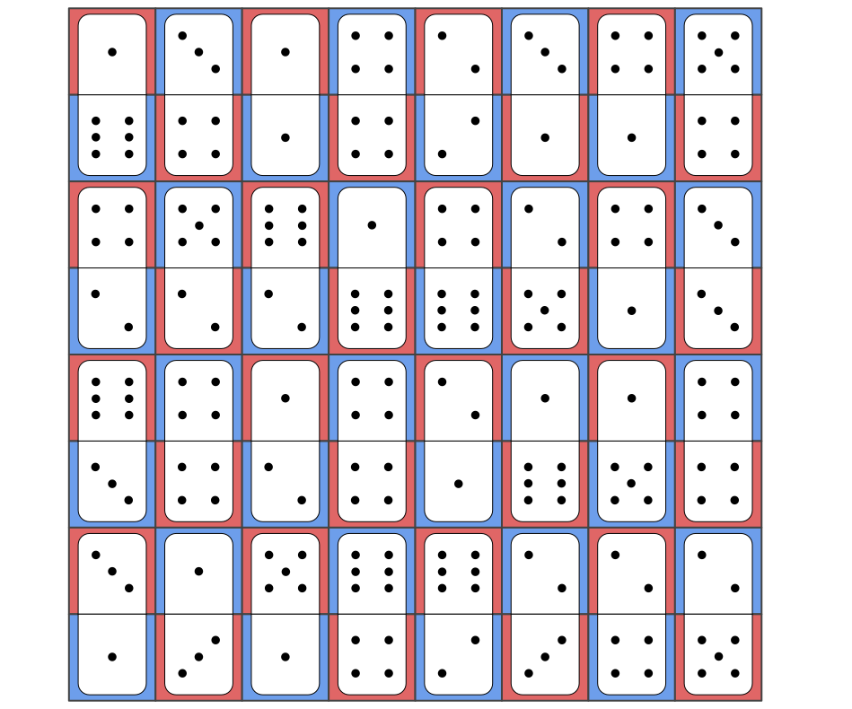
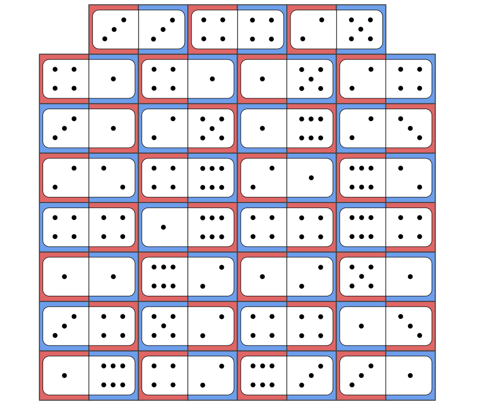

<style>
  @counter-style chap1 {
    system: extends decimal;
    prefix: "1.";
  }
  ol {
    list-style: chap1;
  }
  ol ol {
    list-style: decimal
  }
</style>

# Burger Textbook - Chapter 1
## Lucas LaValva

1. There is only one honest senator. Suppose that there were two or more honest senators. Then it is possible to select two senators who are both honest. However, rule 2 states that

    > Given any two senators, at least one of them is dishonest.

    This is clearly not the case if there are 2 or more senators. 
2. Because either both statements are true or both are false, we can evaluate the following statements:

    ### Case I: Both are false

    > No boxes contain a _Vass_ piece, and the diamond box does not contain snakes

    This statement contains a contradiction, because we know that any box that does not contain snakes must contain the _Vass_ piece. Thus, based on latter half of the statement, the diamond box should contain the _Vass_ piece. The former half of the statement contradicts this, because it claims that there is no _Vass_ piece in either box.

    ### Case II: Both are true

    > At least one box contains a _Vass_ piece, and the diamond box contains snakes

    This is must be true because Case I contained a contradiction. Therefore, Indianapolis Jones should look in the box with swords on it to find the _Vass_ piece.

3. Solution for 8x8 grid:

    

    Solution without top corners:

    

    There is no solution for a checkerboard for which the opposing corners have been removed. This is definitely true because each domino must cover one black square and one white square, but the number of black squares is not equal to the number of white squares.

4. Every square must contain the same number.

    Proof (by contradiction). Suppose that there are two tiles on this infinite checkerboard which are not equal. Then at some point in between the two tiles, there must be a boundary which separates a larger integer from a smaller one. Let the smaller number be known as $i$, and the larger one as $i+k$. Then the other three tiles surrounding $i$ must contain natural numbers $w, x, y$ such tha
    $$
      \frac{w+x+y+(i+k)}{4}=i.
    $$
    In order for this to be true, at least one of $w, x, y$ must be less than $i$. This new smaller value may be redefined as $i$, and $i$ as $i+k$. Then the process may be repeated infinitely many times to find that after any initial $i$, it is possible to find any arbitrarily small final value of $i$. However, since we are constrained to the natural numbers this creates a contradiction, as a discrepancy in tile values must always lead to a board which contains negative numbers.

5. Let the number of black and white cards in the first pile be known as $b_1$ and $w_1$ respectively, and those in the second pile as $b_2$ and $w_2$. Without any manipulation, we know that a standard deck of playing cards divided into two equal piles has the following properties:
    $$
      \begin{aligned}
        b_1 + b_2 & = 26 \\
        b_2 + w_2 & = 26.
      \end{aligned}
    $$
    It follows that
    $$
      \begin{aligned}
         26 & = b_1 + b_2 \\
         26 & = b_1 + (26 - w_2) \\
          0 & = b_1 - w_2 \\
        w_2 & = b_1.
      \end{aligned}
    $$
    Therefore, the number of black cards in pile one must be equivalent to the number of white cards in pile two.

6. Let $n$ be the number of pennies in the original pile, and $h\leq n$ be the numeber of heads. Then to create two piles with an equal number of heads, we can blindly remove $h$ pennies from the original pile and flip them all over. To prove this, let us define $h'$ as the number of heads which were moved to the new pile, and $h_{old}$ and $h_{new}$ as the number of heads in the old and new piles, respectively. Then after separating the piles we are left with
    $$
      \begin{aligned}
        h_{old} & = h - h' \\
        h_{new} & = h'.
      \end{aligned}
    $$
    Since there are $h$ pennies in $h_{new}$, after flipping all of the pennies in that pile we find that
    $$
      \begin{aligned}
        h_{old} & = h - h' \\
        h_{new} & = h - h' \\
        h_{old} & = h_{new}.
      \end{aligned}
    $$

7. Two scales are required for this problem. Let the balls of clay be labelled as $\mathbb{Z}_9$. Then we can use the following algorithm to find the heavy ball:
   1. Weigh $\{1,2,3\}$ against $\{4,5,6\}$. If one of the two is heavier, remove the other piles and map the elements to $\mathbb{Z}_3$. Otherwise they weigh the same, so remove the two piles that have been weighed and map the $\{7,8,9\}$ to $\mathbb{Z}_3$.
   2. Weigh $\{1\}$ against $\{2\}$. If one of the two is heavier, it must contain the key. Otherwise, the ball that was mapped to $\{3\}$ contains the key.

8. Since each operation adds nine ping-pong balls and the operation is performed infinitely many times, it is clear that the number of ping-pong barrels is infinite. However, the numbers which are displayed on each ping-pong ball are up for debate because it is possible to prove that any number $n$ is NOT in the barrel. This is because, since there are an infinite number of operations, after $n$ operations have been performed there is no longer a ball with a label of $n$ in the barrel. Thus, the labels of the balls which are in this barrel are paradoxically large and it is impossible to describe them.

9. There is only one possible graph in which all friends shake a different number of hands:
    ```mermaid
    graph LR;
      subgraph Carol & Chris
        Ca((Carol))
        Ch((Chris))
      end
      subgraph Pair 0
        A((8))
        B((0))
      end
      subgraph Pair 1
        C((7))
        D((1))
      end
      subgraph Pair 2
        E((6))
        F((2))
      end
      subgraph Pair 3
        G((5))
        H((3))
      end
      A --- Ca
      A --- Ch
      A --- C
      A --- D
      A --- E
      A --- F
      A --- G
      A --- H
      C --- Ca
      C --- Ch
      C --- E
      C --- F
      C --- G
      C --- H
      E --- Ca
      E --- Ch
      E --- G
      E --- H
      G --- Ca
      G --- Ch
    ```
    Carol must've shaken 4 hands.
  
10. Let all white hats be labelled as 0 and black hats as 1, and restrict the domain to $\mathbb{Z}_2=\{0,1\}$. Then to determine the _parity_ of a specific spot, we can sum the hats in front of it modulo 2. Using the following technique, the class may find an average of $n-0.5$ A's:
    - The person in the back determines the parity of their position, and guesses the corresponding color.
    - Each of the remaining people perform the following procedure:
      - Find the parity of the current position. If it matches the current class parity, then the current person can comfortably announce "white" and allow for the next student to continue with the procedure. Otherwise, the current student can comfortably announce "black" and the next student can continue the procedure _using the opposite class parity_.