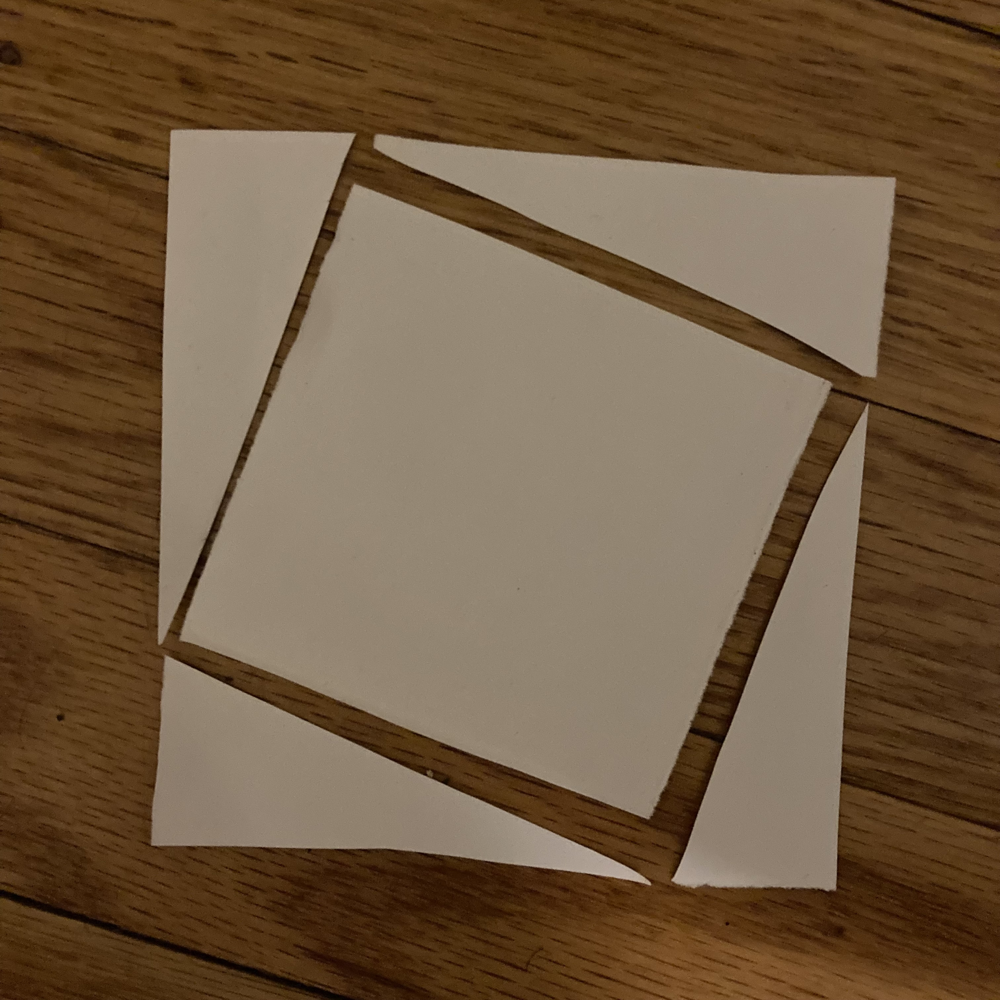
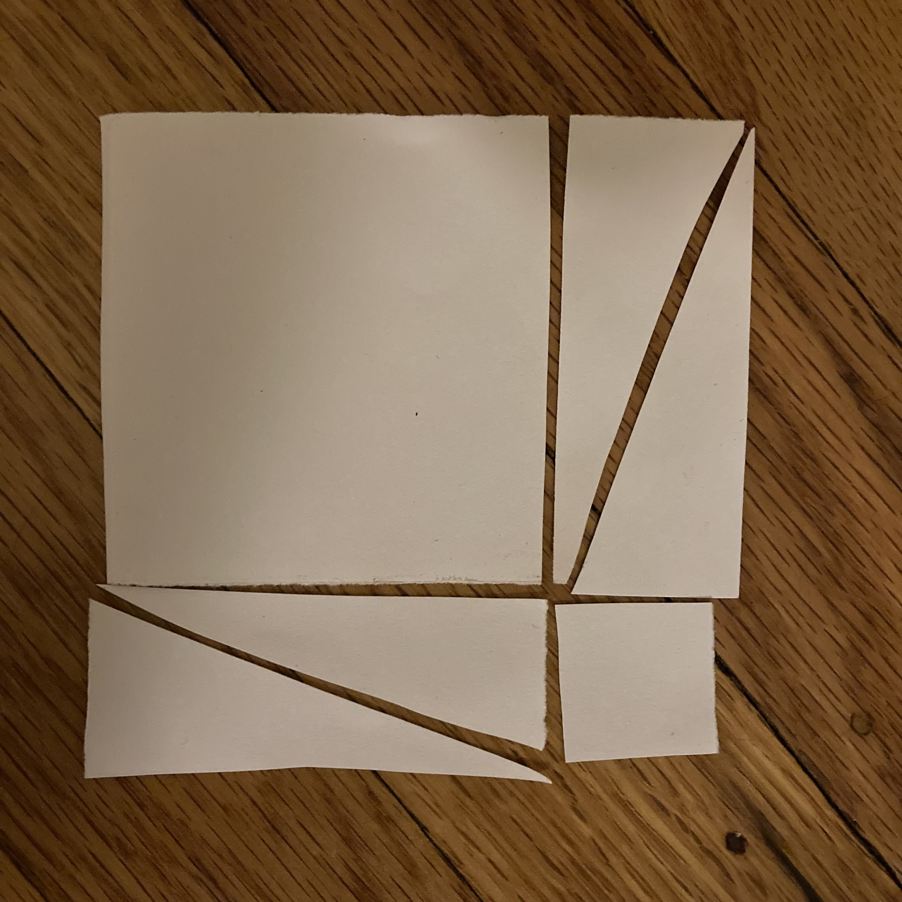

## Chapter 13

11. Members of $\R^N$ are often labelled as coordinate sets of $N$ real numbers $(x_1, x_2, x_3, \ldots, x_{N-1}, x_N)$. This book describes _dimension_ of a space as the fewest pieces of information that are required to locate a specific value within that space. Clearly, this cannot be anything other than $N$ for $\R^N$. If it were any value below $N$ then there would be an additional degree of freedom that was unaccounted for, and if it were any value above $N$ then redundant information would be presented with each coordinate.
12. Check it out, I whipped it up in Blender: [https://youtu.be/GE8AFJEBe5M](https://youtu.be/GE8AFJEBe5M)
13. 
    | Dimension of $n$ | Vertices | Edges | 2-D faces | 3-D faces | 4-D faces |
    | :--------------: | :------: | :---: | :-------: | :-------: | :-------: |
    | $0$              | $1$      | -     |  -        | -         | -         |
    | $1$              | $2$      | $1$   |  -        | -         | -         |
    | $2$              | $4$      | $4$   | $1$       | -         | -         |
    | $3$              | $8$      | $12$  | $6$       | $1$       | -         |
    | $4$              | $16$     | $20$  | $24$      | $8$       | $1$       |
    | $5$              | $32$     | $56$  | $68$      | $40$      | $10$      |
    | $n$              | $2^n$    | $2E_{n-1}+V_{n-1}$ | $2(_2F_{n-1})+E_{n-1}$ | $2(_3F_{n-1})+(_2F_{n-1})$ | $2(_4F_{n-1})+(_3F_{n-1})$ |
14. The volume of any $n$-dimensional cube with side length $s$ is $s^n$. As such, the volume of any cube $\mathcal{C}(n)=1^n=1$ The volume of its "middle", from which a randomly selected point is no longer near the boundary, is equal to $\left(\frac{1}{2}\right)^n=\frac{1}{2^n}$. Clearly, as $n$ approaches infinity this area approaches zero. Thus, for high values of $n$ a randomly selected point within the volume of $\mathcal{C}(n)$ is unlikely to be in its "middle".
15. A ball of dimension $n$ whose diameter is equal to 1 is described in the textbook as $\mathcal{B}(n, 1/2)$, while a cube of the same dimension and side length 1 is described as $\mathcal{C}(n)$. It is clear that $\mathcal{B}(n, 1/2)$ can be contained within $\mathcal{C}(n)$, because if their centers are identical it is impossible to find a point on the surface of $\mathcal{C}(n)$ that is less that $1/2$ away from the center. We can use the following formulas to find volumes:
    $$
    \begin{aligned}
      V\left(\mathcal{B}\left(n, \frac{1}{2}\right)\right)
        & = \frac{\pi^n}{2^{2n}n!}=\left(\frac{\pi}{4}\right)^n\frac{1}{n!} \\
      V(\mathcal{C}(n)) & = 1^n = 1
    \end{aligned}
    $$
    As $n$ approaches infinity, it is clear that the volume of the spehere approaches 0 because $\pi/4<1$ and $1/n!$ also converges. Thus, as the dimension increases the size of the center of the cube decreases.

## Chapter 14

## Chapter 15

1. Each time a vertex is reached by the edge of the paper, the paper turns $180^\circ$. Clearly, after turning it must approach the other side of the paper and make another $180^\circ$ turn before returning to the same side again. Thus, the sequence is $\{R, L, R, L, R, L, \ldots \}$
2. When the paper is folded, all of the strips are folded with it. Each strip becomes two strips, so the number of strips after $n$ folds $S(n)=2S(n-1)$, where $S(0)=1$. This can be simplified to
    $$
      \begin{aligned}
        S(n) & = 2\cdot S(n-1) \\
             & = 2\cdot 2\cdot S(n-2) \\
             & = 2^k\cdot S(n-k) \\
             & = 2^n\cdot S(n-n) \\
             & = 2^n\cdot S(0) \\
             & = 2^n
      \end{aligned}
    $$
3. This is true, at each stage there are $2^n$ strips of paper to fold so that number of folds are added. No folds ever overlap, so there is no need to consider parts of the sequence that may have needed to be eliminated. The only part of this equation that is worth clarifying is the base case; at the $0$-th term of the paper-folding sequence, the paper has 0 folds.
4. Each strip of paper has a right fold on its right side and a left fold on its left side, except for the very bottom strip which only has a right side fold. Since $\sum_{i=0}^k 2^i=2^k+1$, we know from problem (3) that the number of creases on the $n$-th term of the paper-folding sequence is $2^n-1$. If this value is divided according to the information that we acquired at the beginning of this question, we find that there are $2^{n-1}-1$ left folds and $2^{n-1}$ right folds.
5. From problem (1) in this chapter, we know that the fold sequence alternates between left and right after each crease. Since each left strip creates a $\vee$ and each right strip creates a $\wedge$ and every strip is folded during each stage of the sequence, it is obvious that the result is the alternating sequence. 
6. Between each crease, there exists a slip of paper. Each time we fold the paper, every slip acquires a new crease in its center. From question (5), we know that these new folds form the alternating sequence. Thus, each operation in the paper folding sequence is equivalent to interweaving the last sequence with the alternating sequence.
7. The first $2^{n-1}$ terms in the $n$-th paper folding sequence are identical to the ($n-1$)-th paper folding sequence. I am not confident in my ability to find a way to prove this assertion.
8. The last $2^{n-1}$ terms in the $n$-th paper folding sequence are identical to the _complement_ of the ($n-1$)-th paper folding sequence, where in the complement all $\wedge$s become $\vee$s and all $vee$s become $\wedge$s before the entire string is reversed. I am also not confident in my ability to find a way to prove this assertion, but it probably falls out of the proof for part (7).
9. Since $|PFS_n|=2^n$, for each $m$ we can select $n=\log_2(m) + 1$ so that $PFS_n(m)$ exists. Therefore, if $n\to\infty$ it is clear that $|PFS_n|\to\infty$ and thus $PFS_{n\to\infty}(m)$ always exists.
10. 
    $$
      \begin{matrix}
        x^0 & x^1 & x^3 & x^4 & x^7 & x^8 & x^9 & x^{10} & \ldots \\
        x^{0} & x^{2} & x^{6} & x^{8} & x^{14} & x^{16} & x^{18} & x^{20} & \ldots \\
      \end{matrix}
    $$
    I know that we did this example in class and every term of the bottom sequence showed up in the top sequence, but I am unable to replicate this result. Clearly, there is something that I am not doing correctly. I wasted too much time making that animation for problem 12 in chapter 13, so I will not have time to find the error in my ways before this is due.

