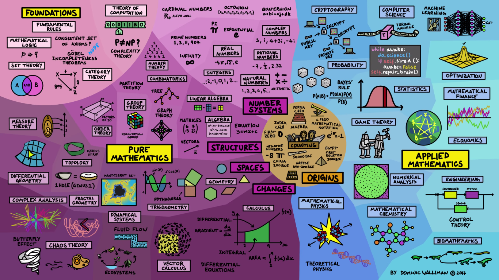

## My College Experience
In a few months, I will be walking out of university as a decorated scholar--- I'll have completed far more than the minimum requirements for degrees in both Mathematics and Computer Science with multiple research experiences, and my name can be seen on two publications about error correcting output codes. By all accounts, I will be in a position that allows me to call myself a mathematician. However, even after all of this education I feel as though this couldn't be further from the truth. My undergraduate degree in mathematics was advertised as a catch-all for the entire field of math; an introduction to all of the subfields that gives each student a wholistic understanding of how large the field is. My expectation was that I would waslk out of school with a solid understanding of every section of this chart, which is hanging in the math tutoring room:

While every title on this poster is familiar to me, I can't claim to have acquired an understanding in many of them through my schooling. Not only do I consider myself clueless about much of mathematics, but I feel so far detached that I can't even claim to know the topics that I need to study on my own in order to further my understanding of mathematics. Overall, while a college education in mathematics was wonderful encouragement for me to learn more about the field, I do not feel as though I have earned the right to call myself a mathematician by completing it.

## Inspiration in Children
I was introduced to Lockhart's Lament a few years ago, around the beginning of the pandemic lockdown. Immediately after I was enlightened to the horrors of Western education in math, I started work as a tutor and math teacher for high-performing middle schoolers under a small word-of-mouth company called MindBytes. On my first day, I was thrown into a Zoom call with two sixth graders and a worksheet with 100 of nearly the exact same question about linear equations. Having been exposed to Lockhart's eye-opening manuscript only a few days before, all excitement about teaching was wiped from my mind. After spending about a dozen minutes walking my students through this worksheet, I felt as though nobody involved was having fun; the students weren't learning as quickly as I had expected them to, and I was not at all inspired to walk them through any more problems. In a final effort to keep my students engaged and my sanity intact, I decided to switch gears at the risk of betraying direct instructions on my first day of work (Luckily, the call was unsupervized). Instead of moving on to yet another page of eerily familiar example problems, I pulled up a blank whiteboard and presented my sixth graders with the triangle-in-rectangle problem from Lockhart's lament. Much to my surprise, after a few minutes each of the two students had discovered a different, equally valid visual proof for the problem, neithe of which were the same as Lockhart's.

The rest of the Zoom call on my first day of work went wonderfully. Instead of working on more boring questions about linear equations, I brought up the Desmos graphing calculator and plugged in $y=mx+b$ to the equation pane. For the remaining 30 minutes of the tutoring session, my students excitedly helped me figure out different ways to manipulate the sliders for $m$ and $b$ in order to make the line cross specific points on the plane.

From that day forward, I started every tutoring session with a different open-ended math question - sometimes we focused on geometry, sometimes on algebra, or on basic group theory or numerical analysis. Each day, I strayed a little bit further from the guided curriculum that I had been given and discovered new areas of math with my students. In the end, it was an extremely enriching experience for both me and the middle schoolers that I had spent time "tutoring". I feel as though my exposure to Lockhart's Lament had a real impact on my tutoring strategy, and I believe that it caused me to create a mathematical spark in students that I would not have found otherwise.